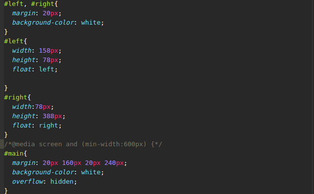
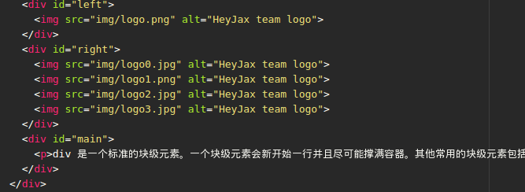
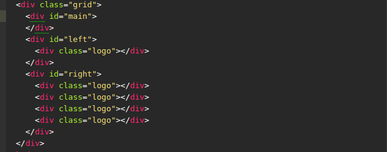
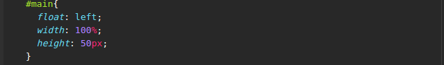
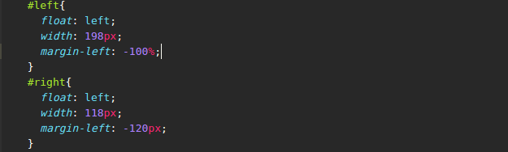
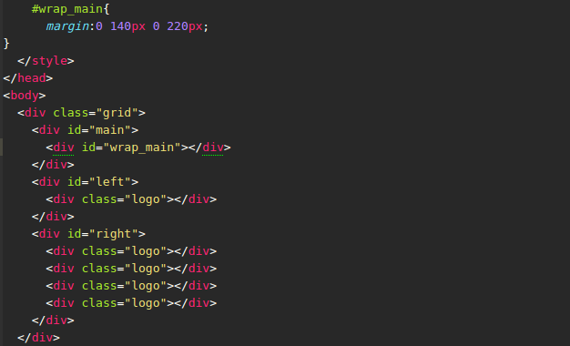

# 任务目标
* 掌握HTML/CSS布局的概念
* 掌握盒模型的概念
* 掌握position与float的概念以及在布局时的用法

# 任务描述
* 使用 HTML 与 CSS 按照 示例图（点击查看） 实现三栏式布局。

* 左右两栏宽度固定，中间一栏根据父元素宽度填充满，最外面的框应理解为浏览器。背景色为 #eee 区域的高度取决于三个子元素中最高的高度。

# 达成度
* 查看[Demo](http://codepen.io/StevenYuysy/details/XdjwGY/)

### html布局
* 此次demo并没有应用到html5中的语义化标签，只是用了div达到效果

### 浮动布局
* 为了适应不同的页面大小，这里使用了媒体查询，使得阅读更加的方便
* 中间的自适应宽度是通过``overflow:hidden``，在两边的div元素渲染完以后开始渲染自身撑满整个页面，形成BFC元素
* 最外面的容器用了``overflow:auto``来清除左右两边的浮动，使得高度能与子元素的最高高度想匹配

### 盒模型
* 由于强调了盒模型内边距必须为``20px``，而且还有边框宽度，在没有使用``box-sizing``的情况下，实际在给盒子设置宽度盒外边距时，需经过计算使最后结果达到目的
* 在设置外边距时，要注意到box之间存在外边距重叠

# 学习笔记

### 盒模型
* 一张图看懂盒模型

* 默认情况下，一个盒子宽度会由边框长度（border），内边距（padding）以及宽度（width）决定，而当我们把box-sizing设置为border-box以后，一个盒子的宽度，就会只由宽度（width）决定了

### 浮动 float
* 为什么使用float？
    * 我们知道，如果在不使用定位的情况下，元素默认定位``static``，即所有文档都在文档流以内，由上到下进行排列，而当我们想要创造出多列布局的时候，就必须要由元素脱离文档流进行排列，此时可以想到的要么改变其``position``，要么则用``float``，在css3属性当中，新增添的``flex``属性同样可以达到多列布局的效果。    
    * 有时候我们需要一个元素脱离文档流，然后把它安放在容器的左端或者右端，并且其他文本和行内元素围绕它安放。
    * 可以取的值包括``left``,``right``,``none``
* 浮动元素如何定位？
    * 当一个元素浮动之后，它会被移出正常的文档流，然后向左或者向右平移，一直平移到碰到了所处的容器的边框，或者碰到了另外一个浮动的元素。
    * 如果由多个元素浮动，例如向左，那么它们会从左到右依次排开，直到填满一整行，然后往下一行填。
* 清除浮动
    * 什么是清除浮动？为什么要清除？我们知道当一个元素脱离文档流后，往往下一个元素会与之重叠，这个时候就需要加一点css属性来达到清除浮动的效果
    * ``clear:both``会使得元素不再与浮动元素重叠，但是如果不符合块格式化上下文block formatting context的话，如包含多个浮动属性，就会使元素出现浮动元素的下方，但是假如我们的目的时创造多列布局，则应该使用另外一种属性``overflow:auto ``或者``overflow:hidden``，利用这个可以达到容器伸展的效果
    * 除此之外，我在网易云课堂学习的时候，由另外一种方法可以清除浮动，利用的时在元素后面的``:after``创造一个不可见的内容只为一个小点的容器来清除浮动``.clearfix:after{content:'.';display: block;clear: both;height: 0;overflow: hidden;visibility: hidden;}``

### 创建多列布局的效果
* 利用BFC原理（即块级格式化上下文）
    * 原理是，先渲染浮动在左右两边的block元素，最后再渲染中间的block元素，并设置为``overflow:hidden``使得可以顺利撑开自适应并且插入其中。
    * html部分
    
    * css部分
    

* 双飞翼布局
    * 双飞翼布局主要利用了浮动、负边距、相对定位三个布局属性，使三列布局就像小鸟一样，拥有中间的身体和两侧的翅膀，并且浏览器兼容性非常好，带IE6。
    * 首先有如下所示布局
    * 
    * 首先我们将中间元素放在文档流最前面优先渲染，然后使其向左浮动，并设置 width 为 100%
    * 
    * 此时中间元素撑满整个页面，然后给小鸟加上双翼，将左右两列元素均设为左浮动，然后通过调整负边距将其定位在各自的位置上
    * 
    * 此时会发现，中间元素的虽然撑开了，但是会和左右两边重叠，那怎么办呢？只需要在中间裹上一层元素就可以解决这个问题了，完成以后，调整左右边距便可以达到我们想要的效果。
    * 

* flex布局
    * flex可以用来制作弹性布局，方法很简单，在主容器设置``display:flex``，在需要自适应的部分依比例将flex值设置为1，2，3等整数即可，具体demo可以查看MDN
    * 缺点是兼容性不太好

###文章参考
* [MDN-float](https://developer.mozilla.org/en-US/docs/Web/CSS/float)
* [cnblog](http://www.cnblogs.com/honoka/p/5161836.html)
