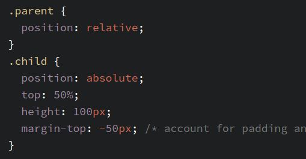
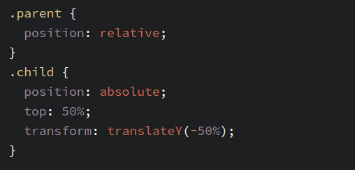
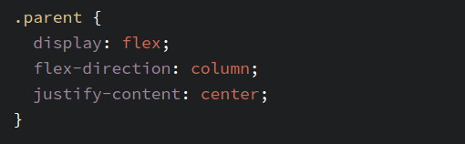

# 任务目的
* 实践HTML/CSS布局方式
* 深入了解position等CSS属性

# 任务描述
* 实现如下示例图的效果

* 灰色元素水平垂直居中，有两个四分之一圆位于其左上角和右下角。

#团队review
### class or id?
* 在原来的代码中，我用了id来修改圆的样式，在review时得到了以下feedback
* 由于id的唯一性以及class的可复用性，当我们在使用css给html添加样式时，理应以class为主
* 在后期的维护和优化中，利用class会更加方便，且当我们需要给特定元素赋予样式时，不会因为id的唯一性导致覆盖不了
* 一般来说js会更加需要用id，如果不这样做，js的getElementById就无法使用，同时，使用过多的id会带来命名空间污染  

# 达成度
* 查看 [demo1](http://codepen.io/StevenYuysy/pen/PNbbRY)，实现方式：主元素利用绝对定位以及负外边距，里面圆形元素采用相对定位。
* 查看 [demo2](http://codepen.io/StevenYuysy/pen/eZBgNr)，实现方式：主元素利用绝对定位以及transform调整位置，里面圆形元素采用相对定位。
* 查看 [demo3](http://codepen.io/StevenYuysy/pen/NNbdGp)，实现方式：需要由外界容器，容器里面设置成``display:flex``以及其他居中属性，里面圆形仍采用相对定位。

# 一个元素如何居中？
查看原文请移步[Centering in CSS: A Complete Guide](https://css-tricks.com/centering-css-complete-guide/)

### 水平居中
* block元素的``margin: 0 auto``实现原理：上下边距为0，左右边距设置为auto时，这个元素在水平方向上会撑满整个页面，而在block元素设置里宽度以后，撑满页面的就会变成其外边距，从而达到居中的效果。
* inline元素的``text-align:center``实现原理：其css属性规定了inline元素可以会自动居中。同理，当存在多个inline元素时，会按从左到右的顺序排列再居中。

### 垂直居中
* inline元素的等内边距``padding-top``==`` padding-bottom``，上下两边的内边距相等，则中间内容居中
* inline元素的行高``line-height``==``height``，行高与容器高度相等，则中间内容居中
* inline元素的``vertical:middle``实现原理:css属性垂直居中文字，vertical有多个属性可选，默认是baseline属性
* block元素利用绝对定位以及负外边距，适用于知道元素的宽度和高度，兼容性好，参照下图，注意这里的外边距减去的是block元素宽度的一般，即``margin:-（width/2） px``

* block元素利用绝对定位以及transform，适用于不知道元素的宽度盒高度，参照下图

* block元素在外部的容器，将其设置为下图，则子元素block元素垂直居中

### 水平垂直居中
* 在垂直居中的基础上，block元素的三种方法均能演变为水平垂直居中，前两种只需增加``left``属性以及``margin-left``或者``transformX``当中的一个属性达到目的
* 利用flex的话，添加多一个``align-items:center``即可

# 参考文章
* [Centering in CSS: A Complete Guide](https://css-tricks.com/centering-css-complete-guide/)
