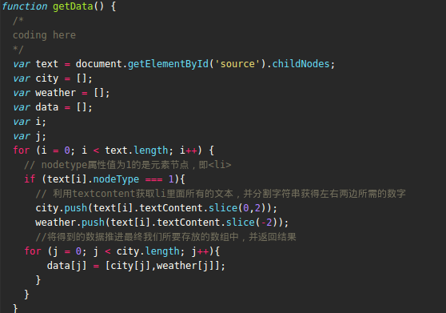

# 前端优化（JavaSript篇）
* 从页面中剥离 JavaScript 与 CSS (Make JavaScript and CSS External)：剥离后，能够有针对性的对其进行单独的处理策略，比如压缩或者缓存策略。
* 精简 JavaScript 与 CSS (Minify JavaScript and CSS)
* 脚本放到 HTML 代码页底部 (Put Scripts at the Bottom)，当脚本在下载的时候，浏览器就不能干别的事情，如果放在首部，会增加HTML和CSS渲染的时间
* 减少 DOM 访问 (Minimize DOM Access)
    * 缓存已经访问过的元素 (Cache references to accessed elements)
    * “离线”更新节点, 再将它们添加到树中 (Update nodes “offline” and then add them to the tree)
    * 避免使用 JavaScript 输出页面布局–应该是 CSS 的事儿 (Avoid fixing layout with JavaScript)

# DOM介绍

* DOM是什么？DOM即document object model 文档对象模型，主要作用有：
    *  提供访问和操作网页内容的方法和接口 。
    *  针对XML但经过扩展用于HTML的应用程序编程接口（API），可以把整个页面映射为一个多层节点结构。
    *  开发人员无需重新加载网页，就可以修改其外观和内容。
    *  DOM1级：映射文档接口
    *  DOM2级：views视图 events事件 style样式 traversal and range遍历和范围
* element node（元素节点）：如果把web上的文档比作一座大厦，这些元素在文档中的布局形成了文档的结构
* text node（文本节点）：文本节点总是被包含在元素节点的内部，但并非所有的元素节点都包含有文本节点
* attribute node（属性节点）：属性节点用来对元素做出更具体的描述。例如，几乎所有的元素都有一个title属性，而我们可以利用这个属性对包含在元素里的东西做成准确的描述
* 每一个节点都是对象

# DOM操作
* 获取元素
    * getElementById，返回的是一个元素
    * getElementsByTagName，返回的是数组
    * getElementsByClassName，返回的是数组
* 创建元素
    * document.createElement(element)
* 插入元素
    * document.appendChild(element)，将一个节点插入到指定的父节点的最末尾处(也就是成为了这个父节点的最后一个子节点)。
    * document.insertBefore(element)，在当前节点的某个子节点之前再插入一个子节点。
* 删除元素
    * document.removeChild(element)	 
* 设置元素样式
    * element.style.property = new style
* 设置元素属性
    * element.attribute = new value
    * element.setAttribute(attribute, value)
* 设置元素文本
    * element.textContent = new content
    * element.innerHTML =  new html content
    * 注意innerHTML会以原始html代码字符串显示，意味着我们可以利用innerHTML来编写html片段，然而MDN里提到由于innerHTML的特殊性，容易被攻击者利用，虽然可以通过正则匹配转换，但是还是建议用textContent获取文本。
* textContent与innerHTML的区别
    * 如果节点是个CDATA片段，注释，ProcessingInstruction节点或一个文本节点，textContent 返回节点内部的文本内容
    * 正如它的名字，innerHTML 返回 HTML 文本。很多时候，当需要往一个元素里面写文本的时候，人们使用 innerHTML，但其实应该使用 textContent，因为文本不会被解析为 HTML，所以它很可能在性能表现上会更好，同时还能够避免XSS攻击。

# 数组处理
* 排序 sort
    * sort() 方法对数组的元素做原地的排序，并返回这个数组
    * 括号里面的参数可选，用来指定按某种顺序进行排列的函数。如果省略，元素按照转换为的字符串的诸个字符的Unicode位点进行排序。
    * 假如需要对数字进行排序，可以给出参数
```
var numbers = [4, 2, 5, 1, 3];
numbers.sort(function(a, b) {
  return a - b;
});
console.log(numbers);

// [1, 2, 3, 4, 5]
```
* for each
    * forEach 方法按升序为数组中含有效值的每一项执行一次callback 函数，那些已删除（使用delete方法等情况）或者从未赋值的项将被跳过（但不包括哪些值为 undefined 的项）。
```
function logArrayElements(element, index, array) {
    console.log("a[" + index + "] = " + element);
}
[2, 5, 9].forEach(logArrayElements);
// logs:
// a[0] = 2
// a[1] = 5
// a[2] = 9
```

# 对象处理
* for in
    * 以任意序迭代一个对象的可枚举属性。每个不同的属性，语句都会被执行一次。
    * 通常，在迭代过程中最好不要在对象上进行添加、修改或者删除属性的操作，除非是对当前正在被访问的属性。这里并不保证是否一个被添加的属性在迭代过程中会被访问到，不保证一个修改后的属性（除非是正在被访问的）会在修改前或者修改后被访问，不保证一个被删除的属性将会在它被删除之前被访问。
    * 如果你只要考虑对象本身的属性，而不是它的原型，那么使用 getOwnPropertyNames() 或执行  hasOwnProperty() 来确定某属性是否是对象本身的属性
```
var obj = {a:1, b:2, c:3};

for (var prop in obj) {
  console.log("obj." + prop + " = " + obj[prop]);
}

// Output:
// "obj.a = 1"
// "obj.b = 2"
// "obj.c = 3"
```

# 事件

### 事件介绍
* 事件流描述的是从页面中接受事件的顺序，历史上有两种事件流，分别是冒泡流和捕获流，基本上我们使用的都是冒泡流(兼容性较好)，即事件开始时是由最具体的元素（文档中嵌套层次最深的那个节点）接收，然后逐级向上传播到较为不具体的节点（文档）


* DOM2级事件规定事件流包括三个阶段，事件捕获阶段、处于目标阶段和事件冒泡阶段


### 事件处理

* HTML事件处理
    * `<input type="button" value="Click Me" onclick="showMessage()">`
    * 特性：创建一个函数，拥有局部变量event，可以直接访问事件对象，this值等于事件的目标元素
    * 缺点：时差问题，即在未解析js之前就触发了事件；HTML与JS代码紧密耦合。
* DOM0级事件处理
    * `var btn = document.getElementById('myBtn');
    btn.onclick = function() {
        alert('Clicked');
    }`
    * 特性：跨浏览器，简单。
    * 删除该事件，直接令其为null。`btn.onclick = null;`
* DOM2级事件处理
    * 两个方法，addEventListener()和removeEventListener()
    * `var brn = document.getElementById('myBtn')
    btn.addEventListener('click', function() {
        alert(this.id)
    },false)
    `
    * 特性：可以添加多个事件处理程序。
* IE事件处理

### 事件对象event
* 在触发DOM上的某个事件时，会产生一个事件对象event，这个对象中包含着所有与事件有关的信息。
* event对象包含与创建它的特定事件有关的属性和方法，常见的有`preventDefault() target`
* 只有在事件处理程序执行期间，event对象才会存在；一旦事件处理程序执行完成，event对象就会销毁。

### 事件委托
* 对“事件处理程序过多”问题的解决方案就是事件委托。事件委托利用事件冒泡，指定一个事件处理程序，就可以管理某一类型的所有事件。

# 字符串处理
* 截取部分字符串
    * slice() 从一个字符串中提取字符串并返回新字符串。
        * 在任务15中，我们要获取北京空气质量：90，的前面和后面，提取出北京，90这两个的数据，我想到的办法就是用slice
    

    * split() 方法通过把字符串分割成子字符串来把一个 String 对象分割成一个字符串数组。
    * replace() 方法使用一个替换值（replacement）替换掉一个匹配模式（pattern）在原字符串中某些或所有的匹配项，并返回替换后的字符串。
        * 任务15里面我聪明的队友用了另外一种更加简便的办法，就是通过正则替换到空气质量，并用split分开
    
* 正则匹配
    * 验证输入，利用unicode字符可以匹配出输入的是否为中文
    ```
    //验证输入为中英文
    var reg = /^[-'a-z\u4e00-\u9eff]{1,}$/i;
    return string.match(reg);
    ```
* 去掉前后空格
`trim()`
